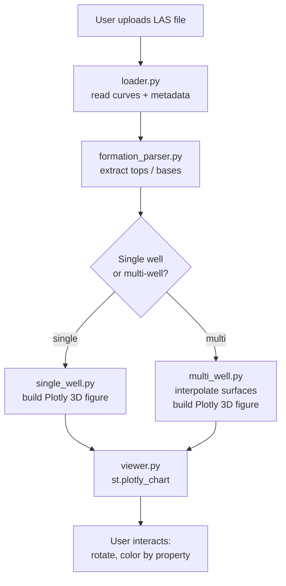

# Architecture — reservoir-visualizer

Single-page Streamlit dashboard that loads LAS files and renders interactive 3D formation layers.

## Workflow



## Inputs and Outputs

| Component | Input | Output |
|---|---|---|
| `loader.py` | `.las` file path | `curves: DataFrame`, `meta: dict` |
| `formation_parser.py` | `meta: dict` (raw LAS header) | `formations: list[dict]` with `name`, `top_ft`, `base_ft` |
| `single_well.py` | `formations`, `curves`, `property_name` | `fig: plotly.graph_objects.Figure` |
| `multi_well.py` | `list[well_data]`, `property_name` | `fig: plotly.graph_objects.Figure` |
| `sidebar.py` | `wells_data: list[dict]` | `{view_mode, selected_well_idx, selected_formations}` |
| `viewer.py` | `fig: Figure`, `wells_data: list[dict]` | Metrics row + rendered 3D chart in Streamlit |

## Data model

**Well metadata dict** (from loader.py):
```python
{
    "well_name": "Black_Stone_B_5",
    "field": "Arroyo",
    "api": "15-187-21195",
    "lat": 37.489573,
    "lon": -101.7879377,
    "elev_ft": 3390.0,
    "depth_start_ft": 1645.0,
    "depth_stop_ft": 5565.5,
    "null_value": -999.25,
    "raw_other": "..."       # raw ~Other section text
}
```

**Formation dict** (from formation_parser.py):
```python
{
    "name": "Lansing-Kansas City",
    "top_ft": 2850.0,
    "base_ft": 3120.0
}
```

## Key constraints

- LAS format: version 2.0, depth in feet, null = -999.25
- Kansas `~Other` section contains `BASE`, `TOP`, `FORMATION` lines
- Plotly 3D chosen over PyVista for native Streamlit integration and Hugging Face compatibility
- No VTK dependency — zero headless rendering issues in deployment

## Source

```
src/las/loader.py
src/las/formation_parser.py
src/render/single_well.py
src/render/multi_well.py
src/ui/sidebar.py
src/ui/viewer.py
app.py
```
