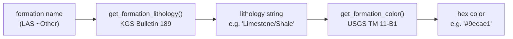

# lithology_map — Formation-to-Color Resolution

Maps formation names from LAS files to lithology types and display colors,
combining two authoritative geological references.

## Purpose

Provide a single lookup layer between a formation name string
(as read from the LAS `~Other` section) and its hex display color,
so that 3D formation blocks and 2D strip logs use consistent,
citable colors across the application.

## Workflow



Resolution order in `get_formation_lithology`:
1. Exact match on `FORMATION_LITHOLOGY` dict
2. Case-insensitive substring match (handles variants like "Heebner Shale Member")
3. Fallback → `"Unknown"` → gray `#bdbdbd`

## Inputs and Outputs

| Function | Input | Output |
|---|---|---|
| `get_formation_lithology(name)` | Formation name string | Lithology string |
| `get_formation_color(name)` | Formation name string | Hex color string |

## Color palette

| Lithology | Hex | USGS convention |
|---|---|---|
| Limestone | `#6baed6` | Blue — carbonate |
| Limestone/Shale | `#9ecae1` | Light blue — mixed carbonate-clastic |
| Shale | `#969696` | Gray — fine-grained clastic |
| Black Shale | `#525252` | Dark gray — organic-rich |
| Sandstone | `#f5c842` | Yellow — coarse clastic |
| Sandstone/Shale | `#d4a520` | Tan-yellow — mixed clastic |
| Dolomite | `#c49a6c` | Brown — diagenetic carbonate |
| Dolomite/Chert | `#a0785a` | Dark brown |
| Chert | `#e08060` | Orange-red — siliceous |
| Conglomerate | `#b8860b` | Dark yellow — coarse clastic |
| Coal | `#252525` | Near black — organic |
| Unknown | `#bdbdbd` | Light gray — fallback |

## Formation coverage (El Dorado field)

| Formation | Lithology | Age |
|---|---|---|
| Oread | Limestone/Shale | Upper Pennsylvanian |
| Toronto | Limestone | Upper Pennsylvanian |
| Heebner Shale | Black Shale | Upper Pennsylvanian |
| Douglas | Sandstone/Shale | Upper Pennsylvanian |
| Lansing | Limestone/Shale | Missourian |
| Kansas City | Limestone/Shale | Missourian |
| Stark Shale | Black Shale | Missourian |
| Checkerboard | Limestone | Missourian |
| Altamont | Limestone | Missourian |
| Cherokee | Sandstone/Shale | Desmoinesian |
| Ardmore | Limestone | Desmoinesian |
| Erosional Chert Conglomerate | Conglomerate | Mississippian |
| Arbuckle | Dolomite/Chert | Ordovician |

## References

- **KGS Bulletin 189** — Zeller, D.E. (1968). *The Stratigraphic Succession in Kansas.*
  Kansas Geological Survey. https://www.kgs.ku.edu/Publications/Bulletins/189/index.html
  *(Formation → lithology assignments)*

- **USGS TM 11-B1** — Lindberg, P.A. (2005). *Selection of Colors and Patterns
  for Geologic Maps.* U.S. Geological Survey Techniques and Methods 11-B1.
  https://pubs.usgs.gov/tm/2005/11B01/05tm11b01.html
  *(Color conventions: blues for carbonates, yellows for clastics, grays for shales)*

## Code reference

```
Source: src/las/lithology_map.py
Tests:  tests/test_lithology_map.py
```
