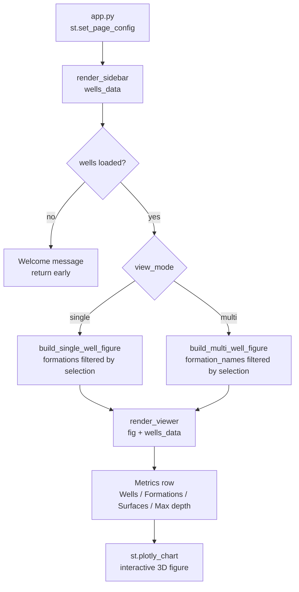

# Streamlit UI — sidebar, viewer, app

Single-page Streamlit dashboard that wires LAS data to 3D renders via a sidebar
control panel and a metrics-plus-chart viewer.

## Workflow



## Components

### app.py

Entry point. Manages session state and dispatches to renderers.

| Key | Type | Description |
|---|---|---|
| `st.session_state.wells_data` | `list[dict]` | Loaded wells; persists across Streamlit reruns |
| `selections` | `dict` | Returned by `render_sidebar`; drives render dispatch |

Dispatch logic:
- `view_mode == "single"` → reads `selected_well_idx`, filters formations, calls `build_single_well_figure`
- `view_mode == "multi"` → passes `selected_formations` to `build_multi_well_figure`; catches `ValueError` and surfaces it via `st.error`

### src/ui/sidebar.py — `render_sidebar`

Renders the left panel and returns user selections.

**Input**: `wells_data: list[dict]` — currently loaded wells (may be empty).

**Returns**:
```python
{
    "view_mode": "single" | "multi",
    "selected_well_idx": int,           # index into wells_data; single mode only
    "selected_formations": list[str] | None  # None = show all
}
```

**Sections rendered**:
1. **Data source** — LAS file uploader (multi-file, `.las`) + *Load El Dorado demo* button.  
   Demo data is loaded via `@st.cache_data` from `data/demo/El Dorado/`.
2. **View mode** — radio: Single well / Multi-well field.
3. **Well selector** — selectbox (single mode only, when >1 well loaded).
4. **Formation filter** — multiselect; multi-mode shows only formations common to ≥2 wells.
5. **Well summary** — caption with well count and field names.

### src/ui/viewer.py — `render_viewer`

Renders a metrics row and the Plotly 3D figure.

**Inputs**:
- `fig: go.Figure` — built by single or multi-well renderer.
- `wells_data: list[dict]` — used for metric computation.

**Metrics row** (4 columns):

| Metric | Source |
|---|---|
| Wells | `len(wells_data)` |
| Formations | unique formation names across all loaded wells |
| 3D surfaces | count of `go.Surface` traces in `fig.data` |
| Max depth (ft) | max `meta["depth_stop_ft"]` across loaded wells |

**Figure height**: read from `data/config.yaml → render.figure_height_px` (default 650).

## Configuration

`data/config.yaml` drives runtime behaviour:

```yaml
app:
  max_demo_wells: 18        # wells loaded from demo directory

render:
  single_well_width_ft: 200.0   # XY footprint of single-well boxes
  multi_well_grid_n: 40         # interpolation grid resolution
  figure_height_px: 650         # Plotly chart height in px
```

## Session state

Only one key is written: `st.session_state.wells_data`.  
Written by `_render_data_source()` (file upload or demo button).  
Read by `app.py` after every `render_sidebar` call.

## Source

```
app.py
src/ui/sidebar.py
src/ui/viewer.py
data/config.yaml
```
