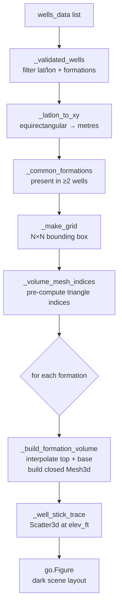

# 3D Renderer — single_well and multi_well

Builds interactive Plotly 3D figures from LAS formation data.
Single-well mode renders a column of formation boxes; multi-well mode
interpolates formation surfaces across N wells as closed volumetric solids.

## Workflow — multi-well



## Coordinate system

| Axis | Units | Convention |
|---|---|---|
| X, Y | metres | equirectangular projection centred on mean well location |
| Z | feet | `elev_ft − depth_ft` (positive = above sea level) |

The equirectangular projection is valid for fields up to ~50 km across.

## Volumetric mesh construction

Each formation is a closed `go.Mesh3d` with 2 × N² vertices (top layer + base layer)
and triangulated faces covering:

- Top face: (N−1)² × 2 triangles
- Base face: (N−1)² × 2 triangles (reversed winding)
- 4 perimeter walls: (N−1) × 2 triangles each

With `_GRID_N = 20`: 800 vertices and ~1,596 triangles per formation.

```
Top surface (N×N grid)
┌──────────────┐  ← elev_ft − top_ft
│   Mesh3d     │
│  formation   │
└──────────────┘  ← elev_ft − base_ft
Base surface (N×N grid)
```

## Interpolation

`scipy.interpolate.griddata` is used per formation:
- **≥3 non-collinear wells**: `method="linear"` (Delaunay triangulation)
- **2 wells or collinear**: `method="nearest"` (automatic fallback via try/except)
- **NaN outside convex hull**: filled with nearest-neighbour values

## Inputs and Outputs

**`build_multi_well_figure`**

| Parameter | Type | Description |
|---|---|---|
| `wells_data` | `list[dict]` | Well dicts with `meta` (lat, lon, elev_ft, depth_stop_ft) and `formations` |
| `formation_names` | `list[str] \| None` | Formations to render; None = all common formations |

Returns `go.Figure` with `go.Mesh3d` per formation + `go.Scatter3d` per well.

**`build_single_well_figure`**

| Parameter | Type | Description |
|---|---|---|
| `formations` | `list[dict]` | Formation list from `formation_parser` |
| `well_name` | `str` | Title label |
| `width_ft` | `float` | XY footprint of each box (ft) |

Returns `go.Figure` with one `go.Mesh3d` box per formation.

## Visual style

Dark petroleum-industry theme matching tools like Petrel and Kingdom:

| Element | Value |
|---|---|
| Scene background | `#0d1117` |
| Grid lines | `#30363d` |
| Well sticks | white, width 10 |
| Axis panels | `#161b22` / `#0d1117` |
| Formation opacity | 0.92 |
| Lighting | diffuse 0.9, specular 0.3, fresnel 0.2 |

## Configuration

Controlled via `data/config.yaml → render`:

```yaml
render:
  single_well_width_ft: 200.0
  multi_well_grid_n: 40        # interpolation resolution (overridden by _GRID_N=20 in code)
  figure_height_px: 820
```

## Source

```
src/render/single_well.py
src/render/multi_well.py
```
